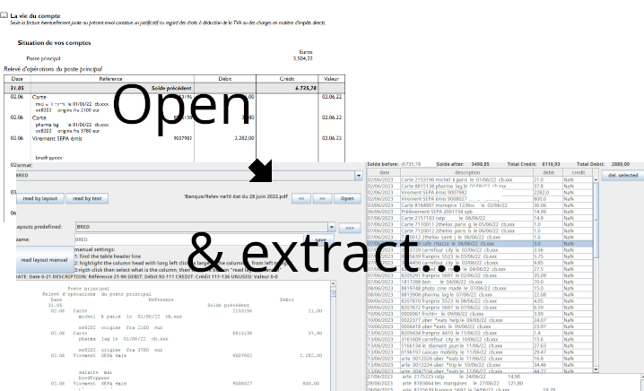

# account-pdf2table

## Purpose

Read a PDF for a bank account and extract the table of the operations.

The purpose is to copy/paste these operations into Excel/Calc file to be imported into an accounting software like Inqom.

The 1st version was to copy/paste manually the PDF from Chrome to the application, and parse the text.

Now it can
- read directly the PDF and its folder
- extract the pdf as text, keeping the layout using the pdfbox library
- be configured to find the table columns 'date', 'description', 'debit', 'credit'
- and get operations in a table you can copy in clipboard to paste it in Excel.

Future feature: be able to open a PDF that is a scanned (aka an image) and use OCR to get the table.

## Usage

- Drag&Drop the PDF on "drop file here"
- Choose a layout that match the bank name & click on "read layout"
- If the operation do not appear correctly, the setting is not ok for the PDF, so, in the left text area:
  - find the start of the table header that should contain "date, description, debit, credit"
  - long press left-click on the line to highlight the date column size, from first to end, & right click and choose "date". It may contain "Date" and spaces.
  - continue for description column, debit and credit columns
  - click "read layout" and check the result. If not ok, fix repeat to fix the size of columns
  - when it's ok, give a name to this setting and click on save to save it on disk
- Click on "copy to clipboard" to copy the operation in clipboard and paste them in Excel.
- Click << and >> arrows to quickly open the next PDF in the folder
- Click "Open" to open the PDF using the default system application used to open PDF

Note: "DATE: Date: 0-21 DESCRIPTION: Description 21-90" means that the DATE column contains "Date" and starts from character 0 to 21.
the DESCRIPTION column contains "Description" and starts from character 21 to 90, etc.

## Note
- It uses Netbeans JPanel editor to create the panels.
- It needs to be cleanup as it contains old code to extract texts not formatted

